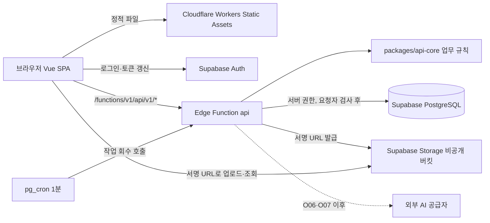

# 기술 아키텍처 기준

2026-10-02 사용자 결정 D25·D26으로 MVP 구성을 바꿨습니다. 2026-09-22의 Cloudflare Workers API·D1·R2 구성(D19 일부·D22·P10)은 아래 [이전 구성](#이전-구성-2026-09-22)에 기록으로 남깁니다. 라이브러리 버전은 호환성·라이선스를 확인해 루트 lockfile로 고정하고, PrimeVue·테마 버전은 [디자인 문서](07_DESIGN_SYSTEM.md)에 기록합니다. AWS 이전 경계는 [플랫폼 이전 문서](19_PLATFORM_MIGRATION.md)를 따릅니다.

## MVP 구성 (2026-10-02~)

| 영역 | 선택 | 상태 | 이유 |
| --- | --- | --- | --- |
| 언어 | TypeScript ESM | 확정 D25 | 웹·서버·공용 계약 타입 일치 |
| 웹 | Vue 3, Vite, Vue Router, Pinia, PrimeVue + OUTFOOT 테마 | 확정 D25 | 기존 화면·테스트 유지 |
| 웹 배포 | Cloudflare Workers Static Assets, 정적 전용(`main` 없음) | 제안 P17 | 아래 [Cloudflare 정적 제공](#cloudflare-정적-제공) |
| 업무 API | Supabase Edge Functions(Deno) 함수 `api` 하나 | 확정 D25·제안 P18 | 서버 처리 경로 하나 |
| 서버 코어 | `packages/api-core` — 웹 표준 Request/Response, Zod | 제안 P18 | Node.js 이전 시 재사용 |
| DB | Supabase PostgreSQL, SQL 마이그레이션 `supabase/migrations` | 확정 D25 | RDS PostgreSQL로 이전 가능 |
| 직원 인증 | Supabase Auth(비밀번호), 업무 사용자와 명시적 매핑 | 확정 D25·제안 P20·보류 O13 | [인증](13_SECURITY_OPERATIONS.md#직원-인증과-계정-상태) |
| 파일 | Supabase Storage 비공개 버킷, 짧게 만료되는 서명 URL | 확정 D25 | S3로 이전 가능 |
| 비동기 작업 | DB 작업 테이블 + 원자적 선점 + 1분 주기 회수 | 제안 P21 | [작업 처리](#분석ai-작업-처리) |
| 검증 | Zod(공용 계약), Vitest, Node 내장 테스트(스크립트·경계 규칙), ESLint 경계 규칙, Deno 타입 검사 | 제안 | 실행환경별 호환 확인 |

초기 개발은 합성 데이터와 mock AI만 사용합니다(D23). 분석 모듈에 Python·OpenCV 서버가 필요한지는 샘플 실험 뒤 결정합니다(O01·O02).

브라우저는 업무 데이터를 Data API로 직접 읽고 쓰지 않습니다(P19). Supabase SDK는 웹에서 로그인·세션 갱신에만 쓰고, 업무 요청은 `apps/web/src/services`를 거쳐 함수로 보냅니다. Cloudflare에는 서버 처리 경로가 없습니다.

## 코드 경계

| 위치 | 담는 것 | 의존 가능 | 의존 금지 |
| --- | --- | --- | --- |
| `apps/web` | 화면·라우터·스토어, `services/`(설정·HTTP·기능별 서비스) | `@outfoot/contracts`, Vue·PrimeVue, Supabase SDK(`services/` 안에서만, T03) | `@outfoot/api-core`, 함수 코드(패키지명·상대경로, 정적·재수출·일반 문자열·표현식 없는 템플릿 동적 import), 서버 비밀값 |
| `packages/contracts` | Zod 계약·enum, 응답 형식 | `zod` | 플랫폼 SDK |
| `packages/api-core` | 라우팅, 설정 검증, 업무 규칙(상태 전이·입력 검증·확정 조건), 플랫폼 경계 타입(`ports.ts`) | `@outfoot/contracts`, `zod`, 웹 표준 API | Supabase SDK, Node 내장 모듈(접두사 유무 무관), `npm:`·`jsr:`·URL import, 실행환경 진입점(`supabase/functions`) 상대경로 import, 동적 import, `Deno`·`process`·`EdgeRuntime`·`Bun`·`Buffer`·`require`·`__dirname` 등 플랫폼·Node 전용 전역과 `globalThis`·`self`·`window`·`global` 경유 접근 (ESLint로 차단, 재수출 포함, `scripts/eslint-boundaries.test.mjs`로 허용·차단 사례 확인). 전역 객체 접근은 로컬 규칙 `outfoot/no-platform-global-access`가 확인합니다: 타입 단언을 두 겹까지 벗긴 식별자의 실제 값 참조를 파서의 참조 해석(`reference.resolved`)으로 확인해, 코드 안의 값 선언(지역 매개변수·변수·import·바깥 함수 값)으로 해석되지 않는 실제 전역일 때만 점 표기의 속성 이름과 대괄호 안 문자열 리터럴을 검사합니다. 매개변수 기본값은 함수 본문의 같은 이름 선언을 가리키지 않으므로 전역으로 검사하고, `type`·`interface` 같은 타입 전용 선언은 런타임 전역을 가리지 않습니다. 같은 이름의 지역 객체(예: 매개변수 `window`)와 일반 객체의 `process` 같은 속성은 허용합니다. 린트는 흔한 유입 경로를 막는 장치이며 별칭 변수, 계산된 속성명(`globalThis[name]`, 대괄호 안 템플릿 문자열 포함), 세 겹 이상 단언, 웹의 문자열 조합·표현식이 든 동적 import 경로까지 증명하지 않음 |
| `supabase/functions/api` | 실행환경 연동: 환경변수 읽기, 로그, Supabase SDK·DB 연결·요청 인증·저장소 구현(후속) | `@outfoot/api-core`, Deno·`npm:` | 업무 규칙 재구현 |
| `supabase/migrations` | 테이블·인덱스·DB 함수·RLS·권한(GRANT) | SQL | 대시보드 수동 변경만으로 끝내기 |

- 함수는 `deno.json` import map으로 `@outfoot/api-core`·`@outfoot/contracts`를 상대 경로로 읽고 `zod`를 `npm:zod@4.6.5`로 고정합니다. Deno lockfile은 끕니다(루트 npm lockfile 하나 원칙, Edge Runtime의 Deno 버전 차이).
- 공용 코드는 `zod`와 웹 표준 API만 씁니다. Node 전용·Deno 전용 패키지를 공용 코드에 넣지 않습니다. 새 의존성을 공용 코드에 넣을 때는 Node(Vitest)와 Deno(`npm run functions:check`) 양쪽에서 확인합니다.
- `supabase/functions` 밖 파일을 함수가 import하는 방식은 Deno 2.9.6 타입 검사·실행으로만 확인했습니다. Supabase Edge Runtime에서의 동작은 Docker가 준비되는 **T02 착수 시 `npm run functions:serve`로 먼저 확인**하고(완료 조건), 원격 번들·배포(`functions deploy`)는 T18에서 따로 확인합니다. 확인 전에는 `_shared` 복사 구조로 미리 바꾸지 않으며, 로컬 확인에서 실패하면 그때 대안(동기화 스크립트 등)을 정합니다.

## Cloudflare 정적 제공

Workers Static Assets의 정적 전용 설정을 선택했습니다(P17). 근거(공식 문서, 2026-10-02 확인):

- 정적 자산 요청은 무료·무제한이며 Worker 요청 한도에 포함되지 않습니다.
- `main` 없이 `assets.directory`와 `not_found_handling: "single-page-application"`만 두면 파일이 없는 경로에 `index.html`을 200으로 돌려 SPA 직접 경로가 열립니다.
- 기존 Wrangler 설정·명령을 그대로 쓸 수 있고 Worker 스크립트가 없어 서버 처리 경로가 생기지 않습니다. Pages도 지원되지만 Pages Functions를 쓰지 않을 이유를 따로 관리해야 해 택하지 않았습니다.

설정은 `apps/web/wrangler.jsonc`(`dist/client` 제공)이고 명령은 `npm run cf:preview`(로컬), `npm run cf:deploy --workspace @outfoot/web`(원격, O08·승인 후)입니다. 두 명령 모두 먼저 웹 빌드(타입 검사, Vite 빌드, 번들·웹 환경변수 비밀값 검사)를 실행하고, 하나라도 실패하면 Wrangler 단계로 넘어가지 않습니다. 두 명령은 `-c wrangler.jsonc`로 설정 파일을 명시해, 이전 Cloudflare Vite 플러그인이 남길 수 있는 `.wrangler/deploy/config.json` 리다이렉트(옛 Worker를 가리킴)를 무시합니다.

## 분석·AI 작업 처리

Edge Functions 공식 제한(2026-10-02 확인): 요청당 CPU 2초, 메모리 256MB, 벽시계 150초(무료)·400초(유료), 응답 전 유휴 150초. `EdgeRuntime.waitUntil` 백그라운드 작업도 같은 제한 안에서 끝나지 않으면 중단되며 완료가 보장되지 않습니다. 따라서 무거운 이미지 처리와 긴 AI 호출을 요청 처리 안에서 끝내는 설계를 하지 않습니다.

MVP 기본 방식(P21 구현 제안, T10A에서 구현·검증. 고객 확정 사항 아님):

1. **요청과 조회 분리**: 분석 요청 API는 입력 스냅샷 해시·입력 버전·요청자·`idempotencyKey`(상담·종류·입력 버전 기준)를 담은 작업 행을 만들고 작업 ID를 돌려줍니다. 같은 키의 중복 요청은 기존 작업을 돌려줍니다. 결과는 별도 조회 API로 봅니다.
2. **상태 저장**: `QUEUED → RUNNING → SUCCEEDED | FAILED | NOT_CONFIGURED | OUTCOME_UNKNOWN`, 결과의 값별 상태(`MEASURED`·`NOT_PROVIDED`·`NOT_MEASURABLE` 등)는 성공과 구분합니다.
3. **실행 주체와 경로**: 실행기는 함수 `api`의 내부 작업 경로이며, Supabase pg_cron이 1분마다 pg_net으로 호출합니다(호출 키는 Vault에 보관). 요청 직후 한 번 바로 실행을 시도할 수는 있지만 그것만으로 완료를 보장한다고 보지 않습니다.
4. **원자적 선점**: DB 함수가 `FOR UPDATE SKIP LOCKED`로 한 건을 골라 `RUNNING`, 새 `lockToken`, `lockedUntil`(임대 만료), `attempt + 1`을 한 번에 기록합니다. 중단 회수로 다시 선점하는 경우도 `attempt`가 늘어나며 같은 상한을 적용합니다.
5. **외부 전송 단계 기록**: 외부 공급자(AI 등)를 부르는 작업은 `dispatchState`를 둡니다(`NOT_SENT → SENDING → RESPONSE_STORED`). 전송 직전에 한 번의 갱신으로 소유권·임대를 확인하면서 `SENDING`·`dispatchedAt`을 기록하고(`WHERE id = ? AND lockToken = ? AND status = 'RUNNING' AND lockedUntil > now()`), 이 갱신이 커밋된 경우에만 외부 요청을 보냅니다. 응답은 원문과 함께 같은 소유권 조건으로 저장하며 `RESPONSE_STORED`와 결과 상태를 기록합니다.
6. **중단 회수**: 임대가 지난 `RUNNING` 작업은 다음 주기에 회수합니다.
   - `NOT_SENT`(외부 전송 전 중단, 또는 외부 호출이 없는 작업): 다시 선점해 실행합니다.
   - `SENDING`(전송됐을 가능성 있음. 전송 직후 중단, 응답 수신 후 DB 저장 전 중단 모두 여기에 남음): 공급자의 중복 방지(같은 요청 키 재전송 시 원 결과를 돌려준다는 공식 보장)나 요청 ID로 결과를 조회하는 기능이 공식 문서로 확인된 경우에만 그 방법으로 확인합니다. 확인할 수 없으면 `OUTCOME_UNKNOWN`으로 바꾸고 자동으로 다시 부르지 않습니다.
   - 늦게 끝난 이전 실행의 결과 저장은 `lockToken`이 달라 반영되지 않습니다. 임대 토큰은 **DB 결과 덮어쓰기를 막는 수단일 뿐 외부 중복 호출·중복 과금을 막지 못합니다.**
7. **재시도 상한**: 일시 오류(전송 전 확인된 실패, 공급자가 명시적으로 거절한 요청 등)만 재시도하고 `runAfter`를 늘려 간격을 둡니다. 기본 제안 최대 3회(1·5·15분)이며 중단 회수로 인한 재선점도 횟수에 포함합니다. 초과 시 `FAILED`. 입력 부족·미구성·형식 오류는 재시도하지 않습니다.
8. **중복 제출과 수동 재시도 구분**: 같은 `idempotencyKey`(상담·종류·입력 버전)로 들어온 요청은 새 작업을 만들지 않고 기존 작업을 돌려줍니다. `OUTCOME_UNKNOWN`·`FAILED` 뒤 담당자가 비용 중복 가능성을 확인하고 다시 실행하는 것은 수동 재시도로, 새 시도 번호를 포함한 새 키와 `retryOf`(이전 작업), 확인한 사람·시각을 남깁니다(감사 기록).
9. **오래된 결과**: 결과의 입력 버전이 현재 상담 입력 버전과 다르면 `STALE`로 계산하고 최종확정에 쓰지 못합니다.
10. **외부 AI 중복 과금**: 공급자가 같은 요청 키로 중복 실행을 막는지 공급자 선택(O06) 때 공식 문서로 확인합니다. 확인 전에는 지원하지 않는다고 가정합니다. "정확히 한 번 실행"을 보장한다고 표현하지 않습니다.
11. **무거운 분석 분리 경계**: 발도장 분석 실행부는 같은 작업 테이블을 선점·보고하는 계약(`analyze(input) -> normalizedResult`, [발도장 문서](11_FOOTPRINT_ANALYSIS.md))으로 두어, OpenCV 등이 필요하면 외부 실행 서버(추후 Node·Python 프로세스)가 같은 DB 함수로 작업을 가져가게 합니다.

별도 큐 서버는 부하 근거가 생기기 전에는 두지 않습니다. pg_cron·pg_net·Vault는 Supabase 확장 기능이므로 [이전 문서](19_PLATFORM_MIGRATION.md#supabase-전용-기능과-대체)에 대체 방법을 적습니다.

## 모듈 경계

업무 모듈은 `packages/api-core/src/modules/<이름>`(후속 작업에서 생성)에 두고, 저장소·인증·파일 구현은 진입점에서 주입합니다.

- `auth`: 직원 인증 결과 확인, 업무 사용자 매핑, 역할·기관·활성 상태 확인
- `patients`: 환자 기본정보와 검색
- `consultations`: 회차, 담당자, 상태, 수정 버전
- `questionnaires`: 고정 정의, 링크 토큰, 제출 스냅샷
- `media`: 파일 메타데이터, 업로드·다운로드 권한
- `footprints`: 분석 요청·결과·시술자 보완, 공급자 계약
- `ai-analysis`: 지식 버전·요청 스냅샷·구조화 출력·오래됨 처리
- `jobs`: 작업 선점·회수·재시도
- `reports`: 최종본과 고객 안내 인쇄 데이터
- `users`: 관리자 계정관리
- `audit`: 중요 변경 기록

## 환경

로컬·스테이징·운영은 Supabase 프로젝트와 비밀값을 분리합니다. 환경변수 예시는 웹 공개값 `.env.example`(VITE_*), 함수 비밀값 `supabase/functions/.env.example`에 두고 실제 값은 Git에 넣지 않습니다. 함수에는 `SUPABASE_URL`·키·`SUPABASE_DB_URL`이 자동 주입되며 `SUPABASE_` 접두사 이름은 직접 만들 수 없습니다. 웹 빌드는 `scripts/check-web-bundle.mjs`로 번들과 `VITE_` 환경변수를 검사합니다. 형식이 알려진 비밀값(Supabase `sb_secret_` 키, role이 `service_role`인 JWT, `sk-` 형식 키, DB 접속 문자열, 개인 키)과 비밀값으로 보이는 `VITE_` 이름만 찾을 수 있고, 형식이 없는 값은 찾지 못합니다. 공개 키(`sb_publishable_`, role이 `anon`인 JWT)는 허용합니다. 타입 선언(`env.d.ts`)은 오타를 줄이는 장치일 뿐 유출 방지 장치가 아닙니다.

로컬 Supabase(`npx supabase start`, `npm run functions:serve`)는 Docker가 필요합니다. 운영 배포 전에 Cloudflare·Supabase 계정·도메인 소유자, 요금제·월 예산, 데이터 리전·보관 요구, 복구 목표를 확인합니다(O08).

## 기술 게이트

발도장 샘플을 받으면 `experiments/footprint-*`에서 작은 실험을 합니다. 동일 샘플·기준값으로 OpenCV, OpenAI API, 병행 방식의 측정 가능성·실패율·비용을 비교하고 선택 기록을 갱신한 후 프로덕션 어댑터를 구현합니다.

## 이전 구성 (2026-09-22)

2026-09-22에는 Vue 정적 자산을 Workers Assets로, `/api/v1`을 `apps/api`의 Worker로 처리하고, 업무 데이터는 D1, 이미지는 R2, 장기 작업은 D1 작업 테이블과 Queues 검토로 계획했습니다. 실제 구현은 상태 확인·합성 데모 경로 두 개뿐이었고 원격 자원은 만들지 않았습니다. 2026-10-02 T01A에서 `apps/api`, Cloudflare Vite 플러그인, D1·R2 바인딩, 데모 API를 제거했습니다.
