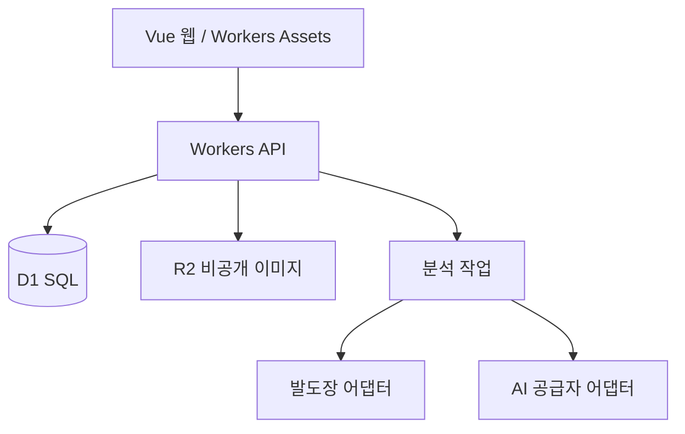

# 기술 아키텍처 기준

핵심 스택은 2026-09-22 사용자 결정으로 확정했습니다. 라이브러리 버전과 세부 구현은 프로젝트 초기화 시 호환되는 최신 안정 버전을 확인해 lockfile로 고정합니다.

## 제안 스택

| 영역 | 제안 | 이유 |
| --- | --- | --- |
| 언어 | TypeScript ESM | 웹·API·공유 계약의 타입 일치 |
| 웹 | Vue 3, Vite, Vue Router, Pinia | SPA 상담 입력과 상태관리 |
| UI | PrimeVue + OUTFOOT 테마 | Vue용 접근 가능한 입력·표·대화상자 재사용 |
| API | Cloudflare Workers | 웹 표준 API 기반 서버리스 HTTP API |
| 검증 | Zod | HTTP·AI 출력의 실행시점 검증 |
| DB | Cloudflare D1 | 관계형 회차·버전·감사 데이터를 SQL로 관리 |
| 파일 | Cloudflare R2 | DB에 이미지 바이너리 저장 방지 |
| 테스트 | Vitest, Cloudflare Workers 테스트 연동, Playwright | 단위·API·핵심 흐름 |
| 운영 | Workers Assets, Wrangler, GitHub Actions 제안 | 웹·API 배포와 환경 분리 |

초기 개발은 합성 데이터와 mock AI만 사용합니다. 분석 모듈에 Python이 필요한지는 샘플 실험 뒤 결정하며, 프로덕션 코드는 언어와 공급자에 중립적인 어댑터 계약을 둡니다.

## 구성

Vue 정적 자산은 Workers Assets로 제공하고 `apps/api`의 Worker가 `/api/v1` 요청을 처리합니다. 로컬 개발은 Cloudflare Vite 연동과 로컬 D1·R2 에뮬레이션을 사용합니다. 장기 작업은 D1 작업 테이블에 먼저 저장하고 API는 작업 ID를 반환합니다. 재시작·재시도·중복 방지를 위해 `idempotencyKey`, `attempt`, `status`, `inputVersion`을 저장합니다. 실제 비동기 실행 방식은 초기 부하와 비용을 확인한 뒤 Queues 사용 여부를 결정합니다.

## 모듈 경계

- `auth`: 로그인, 세션, 역할·기관 권한
- `patients`: 환자 기본정보와 검색
- `consultations`: 회차, 담당자, 상태, 수정 버전
- `questionnaires`: 고정 정의, 링크, 제출 스냅샷
- `media`: 사진 메타데이터, 업로드·다운로드 권한
- `footprints`: 분석 요청·결과·시술자 보완, 공급자 어댑터
- `ai-analysis`: 지식 버전·요청 스냅샷·구조화 출력·오래됨 처리
- `reports`: 최종본과 고객 안내 인쇄 데이터
- `users`: 관리자 계정관리
- `audit`: 중요 변경 기록

## 환경

로컬·스테이징·운영은 D1, R2, 비밀값을 분리합니다. 개발은 합성 데이터와 mock AI만 사용합니다. 환경 변수 이름은 `.dev.vars.example` 또는 `.env.example`에 두고 실제 값은 Git에 넣지 않습니다. 운영 배포 전에 Cloudflare 계정·도메인 소유자, 월 예산, 데이터 위치·보관 요구, 복구 목표를 확인합니다.

## 기술 게이트

발도장 샘플을 받으면 `experiments/footprint-*`에서 작은 실험을 합니다. 동일 샘플·기준값으로 OpenCV, OpenAI API, 병행 방식의 측정 가능성·실패율·비용을 비교하고 선택 기록을 갱신한 후 프로덕션 어댑터를 구현합니다.
